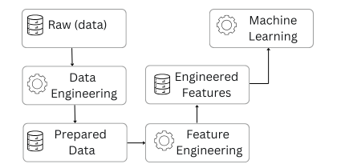
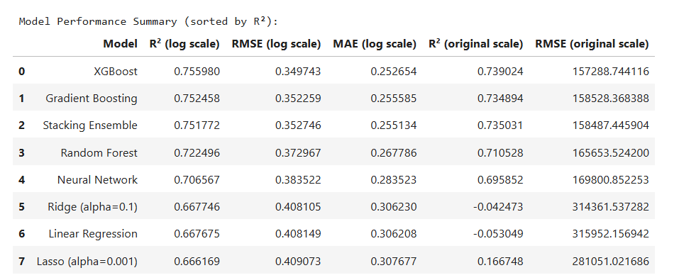
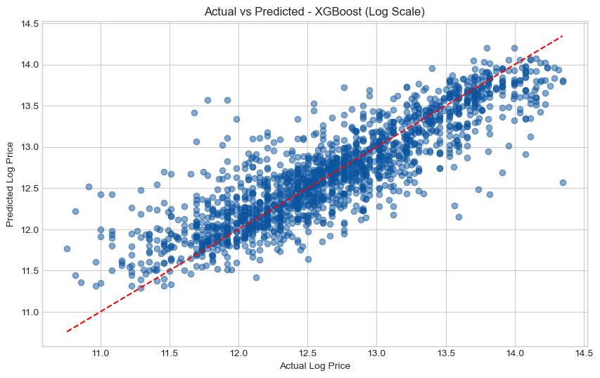

# 🏠 Tunisia Housing Price Prediction 🔮

This project develops a robust machine learning system to predict house prices in Tunisia using data scraped from real estate websites. We demonstrate how to transform messy web-scraped data into valuable real estate insights through careful data cleaning and innovative feature engineering. ✨


## 📊 Project Overview 🌍

In Tunisia and many developing markets, reliable real estate data is scarce, making it difficult for buyers and sellers to determine fair property values. This project addresses this challenge by:

1. 🕸️ **Web scraping real estate listings** from multiple Tunisian property websites
2. 🧹 **Cleaning and preprocessing** problematic data with systematic approaches
3. ⚙️ **Engineering powerful features** that capture complex property relationships
4. 🤖 **Building optimized machine learning models** to predict housing prices accurately



## 🔍 Data Collection

We scraped 16,064 property listings from three Tunisian real estate websites (tecnocasa.tn, menzili.tn, and mubawab.tn) using BeautifulSoup in Python. After evaluating data quality, we selected menzili.tn as our primary source due to its superior data structure and completeness.

The web scraping process followed a systematic pipeline:
1. Evaluating potential websites for data structure consistency
2. Extracting structured property information using Beautiful Soup
3. Storing raw data as JSON then converting to CSV format
4. Removing duplicate listings and standardizing column names

This approach resulted in a dataset of 14,349 unique property listings across 28 columns, providing a comprehensive view of the Tunisian real estate market.


## 📊 Raw Dataset Characteristics

The initial scraped dataset consisted of 14,349 property listings with 27 features. Here's the structure of our raw dataset:

| Column | Non-Null Count | Dtype |
|--------|---------------|-------|
| price | 14349 non-null | float64 |
| property_type | 14349 non-null | object |
| bedrooms | 11240 non-null | object |
| bathrooms | 10274 non-null | object |
| total_rooms | 9103 non-null | object |
| living_area | 14349 non-null | float64 |
| land_area | 14349 non-null | float64 |
| construction_year | 3764 non-null | float64 |
| neighborhood | 14341 non-null | object |
| city | 14341 non-null | object |
| climatisation | 14349 non-null | int64 |
| parabole_tv | 14349 non-null | int64 |
| pool | 14349 non-null | int64 |
| handicapped_access | 14349 non-null | int64 |
| parking | 14349 non-null | int64 |
| garage | 14349 non-null | int64 |
| garden | 14349 non-null | int64 |
| fireplace | 14349 non-null | int64 |
| interphone | 14349 non-null | int64 |
| terrace | 14349 non-null | int64 |
| electric_heating | 14349 non-null | int64 |
| elevator | 14349 non-null | int64 |
| alarm_system | 14349 non-null | int64 |
| internet_access | 14349 non-null | int64 |
| sea_view | 14349 non-null | int64 |
| furnished | 14349 non-null | int64 |
| central_heating | 14349 non-null | int64 |
| kitchen_equipped | 14349 non-null | int64 |

The dataset contains a mix of numeric and categorical features with significant proportions of missing values in key attributes:
- construction_year (73.8% missing)
- total_rooms (36.6% missing)
- bathrooms (28.4% missing)
- bedrooms (21.7% missing)

The binary amenity features (climatisation through kitchen_equipped) are represented as indicator variables (0 or 1) and are complete across all listings.

## 🧹 Data Cleaning

Our initial dataset contained numerous challenges:
- Extreme price outliers (from 1 TND to 10^15 TND)
- Missing values (21.7% missing bedrooms, 28.4% missing bathrooms, 36.6% missing total rooms)
- Inconsistent formats and special string values

We implemented a systematic three-step cleaning approach for price data:
1. **Feature completeness filtering**: Removed listings missing all core structural attributes
2. **Minimum price threshold**: Applied a threshold of 45,000 TND based on Tunisian Real Estate Observatory research
3. **Property type-specific outlier detection**: Used IQR method separately for houses and apartments:
   ```
   Lower bound = Q1 - 1.5 × IQR
   Upper bound = Q3 + 1.5 × IQR
   ```

### Missing Value Analysis and Treatment

We implemented feature-specific imputation strategies based on domain knowledge and statistical analysis:

**Bedrooms and Bathrooms**:
- Created binary indicators ('has_many_bedrooms' and 'has_many_bathrooms') for high-count properties
- Converted string values to numeric format (mapping "10+" to 10, "6+" to 6)
- Applied property type-specific median imputation for missing values:

```python
# Convert string values to numeric
df['bedrooms'] = pd.to_numeric(df['bedrooms'], errors='coerce')

# Calculate medians by property type
bedroom_medians = df.groupby('property_type')['bedrooms'].median()

# Apply median imputation by property type
for p_type in bedroom_medians.index:
    mask = (df['property_type'] == p_type) & (df['bedrooms'].isna())
    df.loc[mask, 'bedrooms'] = bedroom_medians[p_type]
```

**Total Rooms**:
- For missing values, computed the sum of bedrooms and bathrooms
- Created binary indicators for properties with many rooms (>10)
- Capped values at 10 for consistency

**Living Area and Land Area**:
- For apartments: equalized living_area and land_area when one was missing

```python
# For apartments with one area missing, set equal to the other
apartment_mask = df['property_type'] == 'Appartement'
living_null = apartment_mask & df['living_area'].isna() & ~df['land_area'].isna()
land_null = apartment_mask & df['land_area'].isna() & ~df['living_area'].isna()

df.loc[living_null, 'living_area'] = df.loc[living_null, 'land_area']
df.loc[land_null, 'land_area'] = df.loc[land_null, 'living_area']
```

- For houses: implemented ratio-based imputation using median ratio between land area and living area

### Feature Encoding

We implemented multiple encoding strategies:

**Property Type**:
- Converted to a binary 'is_house' feature:

```python
df['is_house'] = df['property_type'].apply(lambda x: 1 if x == 'Maison' else 0)
```

**Neighborhood and City**:
- Applied target encoding to transform high-cardinality categorical variables:

```python
# Target encoding for neighborhood
neighborhood_means = df.groupby('neighborhood')['price'].mean()
df['neighborhood_encoded'] = df['neighborhood'].map(neighborhood_means)

# Target encoding for city
city_means = df.groupby('city')['price'].mean()
df['city_encoded'] = df['city'].map(city_means)
```

**Amenity Features**:
- Standardized the binary amenity indicators to a consistent format with the 'has_' prefix:

```python
# Rename amenity columns for consistency
for col in amenity_columns:
    df.rename(columns={col: f'has_{col}'}, inplace=True)
```

After preprocessing, we retained 8,774 high-quality property listings with complete information for all critical features.

## ✨ Feature Engineering

Our feature engineering process expanded the dataset from 27 basic features to 56 advanced predictors:

### Mathematical Transformations
```python
# Log transformations for area variables
df['log_living_area'] = np.log1p(df['living_area'])
df['log_land_area'] = np.log1p(df['land_area'])

# Polynomial features
df['living_area_squared'] = df['living_area'] ** 2
df['total_rooms_squared'] = df['total_rooms'] ** 2
df['bedrooms_squared'] = df['bedrooms'] ** 2
df['bathrooms_squared'] = df['bathrooms'] ** 2
```

### Interaction Features
```python
# Room interactions
df['bed_bath'] = df['bedrooms'] * df['bathrooms']
df['bed_living'] = df['bedrooms'] * df['living_area']
df['bath_living'] = df['bathrooms'] * df['living_area']

# Property type interactions
df['house_bedrooms'] = df['is_house'] * df['bedrooms']
df['house_living_area'] = df['is_house'] * df['living_area']
df['house_land_area'] = df['is_house'] * df['land_area']

# Location interactions
df['neighborhood_city'] = df['neighborhood_encoded'] * df['city_encoded']
```

### Ratio Features
```python
# Area ratios
df['living_land_ratio'] = df['living_area'] / np.maximum(df['land_area'], 1)
df['sqm_per_room'] = df['living_area'] / np.maximum(df['total_rooms'], 1)
df['rooms_per_living_area'] = df['total_rooms'] / np.maximum(df['living_area'], 1)
df['avg_room_size'] = df['living_area'] / np.maximum(df['total_rooms'], 1)

# Room proportions
df['bed_bath_ratio'] = df['bedrooms'] / np.maximum(df['bathrooms'], 1)
df['bath_per_room'] = df['bathrooms'] / np.maximum(df['total_rooms'], 1)
```

### Amenity Groupings
```python
# Total amenities count
amenity_columns = [col for col in df.columns if col.startswith('has_')]
df['total_amenities'] = df[amenity_columns].sum(axis=1)

# Amenity categories
basic_amenities = ['has_parking', 'has_garage', 'has_interphone', 'has_kitchen_equipped']
df['basic_amenities'] = df[basic_amenities].sum(axis=1)

comfort_amenities = ['has_climatisation', 'has_central_heating', 'has_electric_heating', 'has_elevator']
df['comfort_amenities'] = df[comfort_amenities].sum(axis=1)

luxury_amenities = ['has_pool', 'has_garden', 'has_terrace', 'has_sea_view']
df['luxury_amenities'] = df[luxury_amenities].sum(axis=1)

# Targeted amenity interactions
df['house_with_garden'] = df['is_house'] * df['has_garden']
df['house_with_pool'] = df['is_house'] * df['has_pool']
```

## 🔬 Training and Model Development

### Dataset Partitioning
We split our cleaned dataset of 8,774 properties into parts using stratified sampling based on price quartiles:

```python
# Create price quartiles for stratified split
df['price_quartile'] = pd.qcut(df['price'], 4, labels=False)

X = df.drop('price', axis=1)
y = np.log1p(df['price'])  # Log transformation of target

X_train, X_test, y_train, y_test = train_test_split(
    X, y, test_size=0.2, random_state=42, stratify=df['price_quartile']
)
```

### Preprocessing Pipeline
We implemented a consistent preprocessing pipeline to ensure proper scaling and handling of any remaining missing values:

```python
from sklearn.compose import ColumnTransformer
from sklearn.pipeline import Pipeline
from sklearn.impute import SimpleImputer
from sklearn.preprocessing import RobustScaler

# Define preprocessing pipeline
numeric_features = X.select_dtypes(include=['int64', 'float64']).columns

preprocessor = ColumnTransformer(
    transformers=[
        ('num', Pipeline([
            ('imputer', SimpleImputer(strategy='median')),
            ('scaler', RobustScaler())
        ]), numeric_features)
    ]
)
```

### Model Selection and Implementation
We trained and evaluated multiple algorithms to identify the optimal approach:

```python
from sklearn.linear_model import LinearRegression, Ridge, Lasso
from sklearn.ensemble import RandomForestRegressor, GradientBoostingRegressor
import xgboost as xgb

models = {
    'Linear Regression': Pipeline([
        ('preprocessor', preprocessor),
        ('regressor', LinearRegression())
    ]),
    
    'Ridge (alpha=0.1)': Pipeline([
        ('preprocessor', preprocessor),
        ('regressor', Ridge(alpha=0.1, random_state=42))
    ]),
    
    'Lasso (alpha=0.001)': Pipeline([
        ('preprocessor', preprocessor),
        ('regressor', Lasso(alpha=0.001, max_iter=10000, random_state=42))
    ]),
    
    'Random Forest': Pipeline([
        ('preprocessor', preprocessor),
        ('regressor', RandomForestRegressor(
            n_estimators=200,
            max_depth=15,
            min_samples_split=5,
            min_samples_leaf=2,
            max_features='sqrt',
            bootstrap=True,
            random_state=42,
            n_jobs=-1
        ))
    ]),
    
    'Gradient Boosting': Pipeline([
        ('preprocessor', preprocessor),
        ('regressor', GradientBoostingRegressor(
            n_estimators=500,
            learning_rate=0.05,
            max_depth=5,
            min_samples_split=5,
            min_samples_leaf=2,
            subsample=0.8,
            max_features=0.8,
            random_state=42
        ))
    ]),
    
    'XGBoost': Pipeline([
        ('preprocessor', preprocessor),
        ('regressor', xgb.XGBRegressor(
            n_estimators=1000,
            learning_rate=0.01,
            max_depth=7,
            min_child_weight=1,
            subsample=0.8,
            colsample_bytree=0.8,
            gamma=0,
            reg_alpha=0.1,
            reg_lambda=1,
            random_state=42
        ))
    ])
}
```

For XGBoost, which gave the best performance, we optimized these hyperparameters:
- Number of trees: 1000
- Maximum tree depth: 7
- Learning rate: 0.01
- Subsampling rate: 0.8
- Column sampling rate: 0.8
- γ (minimum loss reduction): 0
- λ (L2 regularization): 1.0

### Evaluation Metrics
We evaluated model performance using:

- **R²**: Shows the percentage of price variation explained by our model
  ```
  R² = 1 - Σ(y_i - ŷ_i)² / Σ(y_i - ȳ)²
  ```

- **Root Mean Squared Error (RMSE)**
  ```
  RMSE = √(1/n * Σ(y_i - ŷ_i)²)
  ```

- **Mean Absolute Error (MAE)**
  ```
  MAE = 1/n * Σ|y_i - ŷ_i|
  ```

- **Mean Absolute Percentage Error (MAPE)**
  ```
  MAPE = (100%/n) * Σ(|y_i - ŷ_i|/y_i)
  ```

## 📈 Results and Insights

Our best model (XGBoost with engineered features) achieved:
- R² of 0.756 (log-transformed prices) / 0.739 (original prices)
- RMSE of 157,289 TND
- MAE of 97,347 TND

### Detailed Model Performance Comparison



Key findings:
- Tree-based models significantly outperformed linear models, with R² improving from around 0.62 to 0.74
- The stacking ensemble did not improve upon the performance of the best individual model (XGBoost), suggesting that XGBoost already captures most of the predictive patterns
- XGBoost achieved the best overall performance with an R² of 0.739

 

### Feature Importance Analysis

We analyzed feature importance from the best-performing model (XGBoost) to identify the most influential predictors:

1. **bath_living** (bathrooms × living area interaction) emerged as the most important feature, accounting for 25.77% of the model's predictive power
2. **living_area_squared** was the second most important feature (17.99%), indicating a strong non-linear relationship between living area and price
3. **house_land_area** ranked third (4.60%), highlighting that land value for houses is a significant price determinant
4. **neighborhood_city** interaction appeared in the top features, confirming the importance of location
5. Luxury amenities, particularly **house_with_pool**, showed high importance

### Value of Feature Engineering

| Features Used | Features Count | R² | Improvement |
|--------------|---------------|-----|------------|
| Original features only | 28 | 0.684 | Baseline |
| + Log transformations | 30 | 0.701 | +2.5% |
| + Polynomial features | 34 | 0.715 | +4.5% |
| + Ratio features | 40 | 0.731 | +6.9% |
| + Interaction features | 48 | 0.747 | +9.2% |
| + Amenity groupings | 56 | 0.756 | +10.5% |

This demonstrates that our systematic feature engineering process improved model performance from R² = 0.684 to R² = 0.756, representing a 10.5% increase in explained variance.

## 🌟 Market-Specific Insights

Our analysis revealed several insights specific to the Tunisian real estate market:

1. **Space quality over quantity**: The strong importance of bath_living suggests that Tunisian buyers value the quality of living space (as indicated by bathroom count relative to size) more than simply the size alone
2. **Land value for houses**: The high importance of house_land_area highlights the premium placed on land ownership for houses in Tunisia, reflecting cultural preferences and investment considerations
3. **Luxury amenities**: The significance of features like house_with_pool indicates a distinct luxury segment in the Tunisian market with substantially different pricing dynamics
4. **Location importance**: The presence of neighborhood_city in top predictors confirms that, like global markets, location remains a crucial factor in Tunisian real estate pricing

## 🌐 Web Application Implementation

We've transformed this machine learning model into a user-friendly web application using React (frontend) and Flask (backend). The web app allows users to:

- Input property details (type, rooms, area, location, amenities)
- Get instant price predictions with confidence ranges
- Visualize feature impact on the predicted price
- Compare different property scenarios


The implementation details and setup instructions for the web application can be found in the [web-app](https://github.com/MarouaHattab/House-sale-Price-Predicition/tree/main/web) directory.

## 🌟 Conclusion 🏆

This project demonstrates that machine learning approaches combined with extensive feature engineering can effectively predict housing prices in markets with limited data quality. 🚀 Our model's performance (R² = 0.756) approaches that seen in studies from countries with established real estate data systems (R² = 0.79-0.82).

The success of interaction features (particularly bath_living) challenges traditional assumptions about housing prices being merely the sum of component values. 💡 By capturing these complex relationships, we've created a valuable tool for real estate professionals, homebuyers, and sellers in Tunisia.

### Limitations and Future Work

Despite our robust methodology, several data limitations affect our results:
- Our dataset contains asking prices rather than final sale values
- Important factors like exact age, interior condition, and renovation history were unavailable
- Neighborhood-level location data provides less specificity than GPS coordinates

Future improvements could include:
- Obtaining actual transaction data through collaboration with government agencies
- Adding geospatial features like proximity to schools, hospitals, and transportation
- Collecting time-series data to enable market trend analysis
- Developing separate models for different property types and price ranges
- Implementing spatial regression methods to better capture neighborhood effects
- Integrating computer vision to extract condition and quality information from property images
- Temporal analysis: Incorporating time-based features to capture market trends and seasonality effects
- Image analysis: Leveraging property images through computer vision techniques
- Transfer learning: Exploring applicability to other North African countries with similar characteristics

## 🛠️ Technologies Used 💻

- **Data Collection:** BeautifulSoup, Requests 🕸️
- **Data Processing:** Pandas, NumPy 🐼
- **Machine Learning:** Scikit-learn, XGBoost 🌲
- **Visualization:** Matplotlib, Seaborn 📊
- **Web Application:** React, Flask, Material-UI 🌐

## 🤝 Contributing

Contributions are welcome! Please feel free to submit a Pull Request.

1. Fork the project
2. Create your feature branch (`git checkout -b feature/AmazingFeature`)
3. Commit your changes (`git commit -m 'Add some AmazingFeature'`)
4. Push to the branch (`git push origin feature/AmazingFeature`)
5. Open a Pull Request

## 📧 Contact

Maroua HATTAB - maroua.hattab@polytechnicien.tn 

Samah SAIDI - samah.saidi@polytechnicien.tn