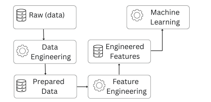
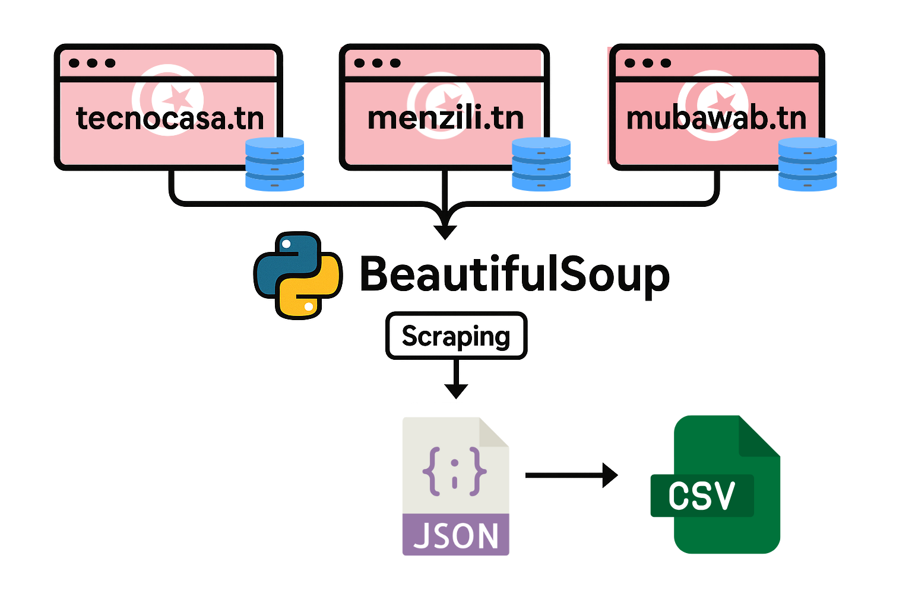

# 🏠 Tunisia Housing Price Prediction 🔮

This project develops a robust machine learning system to predict house prices in Tunisia using data scraped from real estate websites. We demonstrate how to transform messy web-scraped data into valuable real estate insights through careful data cleaning and innovative feature engineering. ✨

## 📊 Project Overview 🌍

In Tunisia and many developing markets, reliable real estate data is scarce, making it difficult for buyers and sellers to determine fair property values. This project addresses this challenge by:

1. 🕸️ **Web scraping real estate listings** from multiple Tunisian property websites
2. 🧹 **Cleaning and preprocessing** problematic data with systematic approaches
3. ⚙️ **Engineering powerful features** that capture complex property relationships
4. 🤖 **Building optimized machine learning models** to predict housing prices accurately



## 🔍 Data Collection

We scraped 16,064 property listings from three Tunisian real estate websites (tecnocasa.tn, menzili.tn, and mubawab.tn) using BeautifulSoup in Python. After evaluating data quality, we selected menzili.tn as our primary source due to its superior data structure and completeness.



## 🧹 Data Cleaning

Our initial dataset contained numerous challenges:
- Extreme price outliers (from 1 TND to 10^15 TND)
- Missing values (21.7% missing bedrooms, 28.4% missing bathrooms)
- Inconsistent formats and special string values

We implemented a three-step cleaning approach:
1. Removed listings missing core structural attributes
2. Applied a minimum price threshold of 45,000 TND based on market research
3. Used property type-specific IQR methods to detect and remove outliers

## ✨ Feature Engineering

Our feature engineering process expanded the dataset from 27 basic features to 56 advanced predictors:

- **Mathematical transformations:** Log and polynomial features
  ```python
  df['log_living_area'] = np.log1p(df['living_area'])
  df['living_area_squared'] = df['living_area'] ** 2
  ```

- **Ratio features:** Efficiency and quality metrics
  ```python
  df['living_land_ratio'] = df['living_area'] / np.maximum(df['land_area'], 1)
  df['sqm_per_room'] = df['living_area'] / np.maximum(df['total_rooms'], 1)
  ```

- **Interaction features:** Combined effects
  ```python
  df['bed_bath'] = df['bedrooms'] * df['bathrooms']
  df['bath_living'] = df['bathrooms'] * df['living_area']
  ```

- **Property type interactions:** Type-specific dynamics
  ```python
  df['house_bedrooms'] = df['is_house'] * df['bedrooms']
  df['house_living_area'] = df['is_house'] * df['living_area']
  ```

- **Amenity groupings:** Functional categories
  ```python
  df['basic_amenities'] = df[['has_parking', 'has_garage', 'has_interphone', 'has_kitchen_equipped']].sum(axis=1)
  df['luxury_amenities'] = df[['has_pool', 'has_garden', 'has_terrace', 'has_sea_view']].sum(axis=1)
  ```

## 🤖 Model Development

We tested multiple machine learning algorithms and evaluated their performance:

| Model                         | R²         | RMSE       | MAE       | MAPE   |
|-------------------            |--------    |------------|-----------|--------|                
| Weighted Ensemble             | 0.7419     | 156,421.31 | 98,131.91 | 29.21% |
| XGBoost (Optimized)           | 0.7372     | 157,837.61 | 98,235.24 | 28.02% |
| XGBoost + Feature Engineering | 0.7560     | 157,289.00 | 97,347.00 | 31.80% |
| Linear Regression             | 0.6163     | 190,724.21 | 130,072.64| 43.39% |

Key findings:
- Tree-based models significantly outperformed linear models
- Feature engineering improved R² from 0.7372 to 0.7560 (2.5 percentage point gain)
- The bathroom-living area interaction emerged as the most powerful predictor

## 📈 Results and Insights

Our best model (XGBoost with engineered features) achieved:
- R² of 0.756 (log-transformed prices) / 0.739 (original prices)
- RMSE of 157,289 TND
- MAE of 97,347 TND

Performance varied by price segment:
- Best performance for mid-priced properties (R² = 0.75)
- Lower accuracy for both low-end and high-end properties (R² = 0.69)

## 🌟 Conclusion 🏆

This project demonstrates that machine learning approaches combined with extensive feature engineering can effectively predict housing prices in markets with limited data quality. 🚀 Our model's performance (R² = 0.756) approaches that seen in studies from countries with established real estate data systems (R² = 0.79-0.82).

The success of interaction features (particularly bath_living) challenges traditional assumptions about housing prices being merely the sum of component values. 💡 By capturing these complex relationships, we've created a valuable tool for real estate professionals, homebuyers, and sellers in Tunisia.

Future improvements could include adding geospatial data 🗺️, collecting time-series information 📈, and implementing separate models for different property types and price ranges. 🏘️

## 🛠️ Technologies Used 💻

- **Data Collection:** BeautifulSoup, Requests 🕸️
- **Data Processing:** Pandas, NumPy 🐼
- **Machine Learning:** Scikit-learn, XGBoost 🌲
- **Visualization:** Matplotlib, Seaborn 📊

## 🤝 Contributing

Contributions are welcome! Please feel free to submit a Pull Request.

1. Fork the project
2. Create your feature branch (`git checkout -b feature/AmazingFeature`)
3. Commit your changes (`git commit -m 'Add some AmazingFeature'`)
4. Push to the branch (`git push origin feature/AmazingFeature`)
5. Open a Pull Request


## 📧 Contact

Maroua HATTAB - maroua.hattab@polytechnicien.tn 
Samah SAIDI - samah.saidi@polytechnicien.tn 